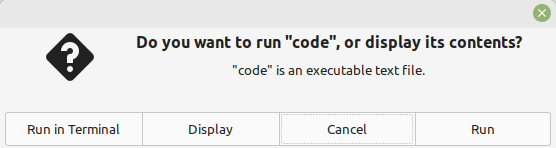
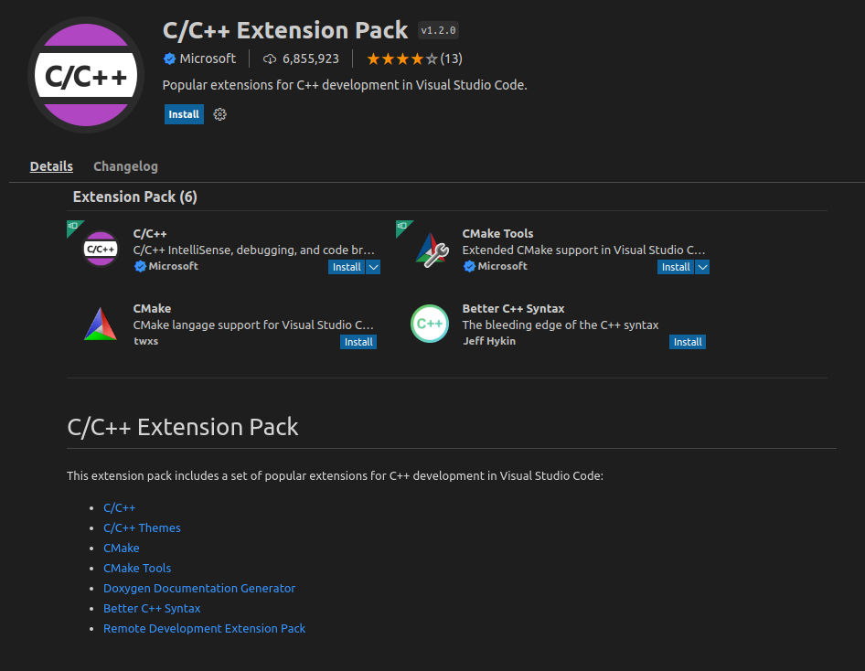
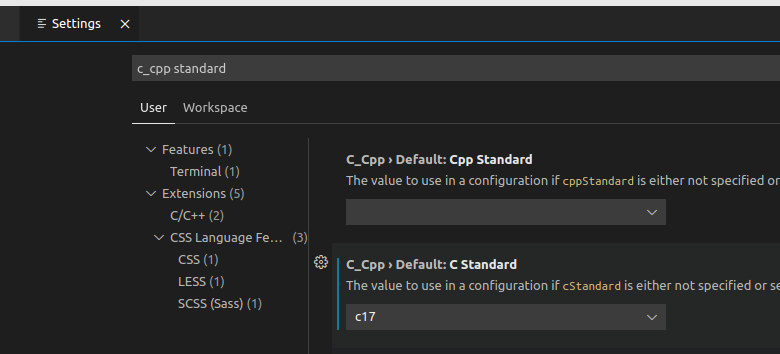
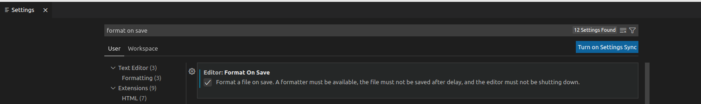

# cg2022

Este repositório contém instruções de configuração do ambiente de desenvolvimento que será utilizado na disciplina `Computação Gráfica`, exemplos de códigos, e muitos erros de português :P

## Configuração do ambiente

A parte prática da disciplina será programada na linguagem C e assume que:
- o sistema operacional utilizado será Linux x64. Caso você não tenha uma distribuição instalada ou preferida, fica como sugestão: [Linux Mint 20.3](https://linuxmint.com/)
- gcc e dependências estão instaladas. No Linux Mint elas podem ser instaladas com o comando: `apt install build-essential libx11-dev -y`

Embora não seja obrigatório, sugere-se a utilização da IDE Visual Studio Code (VS Code), pois ela requer poucas configurações e oferece conveniências como syntax highlighting, code formatting, entre outras.

### Máquina virtual

Para quem utiliza máquinas virtuais, neste [link](https://drive.google.com/file/d/1fv4daw6-TA4CTkYkrgzLt7tJuBM9VABd/view?usp=sharing) há uma Oracle VirtuaBox VM pré-configurada.

Autenticação da VM:
- usuário: `user`
- senha: `password`

Para quem não pode ou não quer utilizar uma máquina virtual, continue lendo :) não é complicado configurar manualmente.

### Configuração manual

Para utilizar o VS Code:
- Download o .tar.gz clicando [(aqui)](https://code.visualstudio.com/download#)
- Extraia o .tar.gz, isso vai criar um diretório chamado `VSCode-linux-x64`
- Navegue até a pasta `VSCode-linux-x64/bin` e execute o programa `code`
  - caso você seja prompted sobre `Run in Terminal` ou `Run`, escolha `Run`: 
- Com o VS Code aberto, pressione `ctrl+shift+x` para abrir o menu de extensões, procure e instale a extensão `C/C++ Extension Pack` 

Se deu tudo certo, o VS Code deve estar configurado para reconhecer código em C, mas ainda precisamos indicar qual versão de C utlizamos:
- pressione `ctrl+,` para abrir o menu `Settings`
- utilize a função de busca para encontrar a opção `c_cpp standard` e selecione c17 

A última etapa, opcional, é habilitar a opção "formatar código toda vez que um arquivo for salvo": no mesmo menu `Settings` da etapa anterior, busque a opção `Format On Save` e marque a caixinha 

### Verificando

Para verificar se tudo está configurado corretamente:
- Clone o repositório `https://github.com/Mirandatz/cg2022`
- Abra a pasta do repositório no VS Code
- Abra o `terminal integrado` do VS Code pressionando ``ctrl+shift+` `` e execute o comando `make env_check`, se uma janela com uma imagem roxa (? amaranth? purple? sei lá o nome) aparecer, então está tudo configurado corretamente :)

## Exemplos de códigos

Os códigos localizados na pasta `src` contém implementações de estruturas de dados e algoritmos da disciplina; elas são apenas exemplos, não implementações canônicas. Sintam-se à vontade (encorajadas(os), na verdade!!) para criar suas próprias versões :)

Caso desejem utilizar esse repositório como base para seus próprios códigos, segue uma breve explicação da sua organização.

O arquivo `Makefile`, localizado na raiz deste repositório é utilizado para compilar e executar os códigos da pasta `src`. Esse arquivo é processado pelo programa `make`, que deve ser invocado na raiz do repositório. Os resultados dependem de quais argumentos forem passados:
- `make`: compila o arquivo `src/main.c`, gerando um executável `src/main.o`, e executa o arquivo `main.o`
- `make run`: mesma coisa que `make`
- `make env_check`: compila o arquivo `src/env_check.c`, gerando um executável `src/env_check.o`, que é executado e depois apagado. Serve exclusivamente para verificar se está tudo ok :)
- `make clean`: remove arquivos (.o) gerados pelo `make`

Para quem tem curiosidade sobre como o programa `make` e o arquivo `Makefile` funcionam, fica a [sugestão de leitura](https://www.gnu.org/software/make/manual/html_node/Introduction.html).

